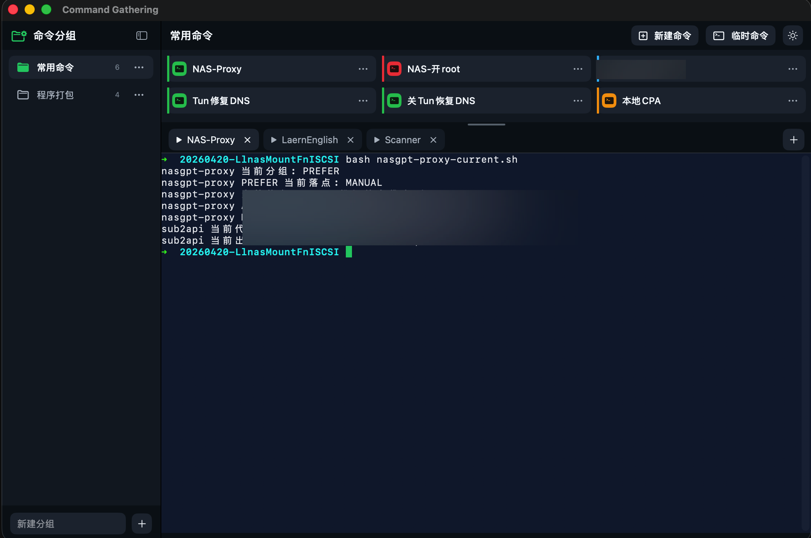

# Command Gathering

macOS SwiftUI 原生命令面板工具，用来按分组管理常用命令，并在应用内终端标签页中执行。

## 界面预览



## 功能

- 左侧命令分组支持新建、重命名、删除和拖拽排序。
- 右侧命令卡片支持新建、编辑、删除和右键操作。
- 点击命令时，如果没有绑定终端 tab 会新建并执行；如果已有绑定 tab 只切换，不重复执行。
- 支持“临时命令”，只开终端不写入配置。
- 终端基于 vendored `SwiftTerm`，默认启动用户交互式 shell。
- 命令配置和终端历史由 App 自己管理，不依赖外部数据库。

## 目录结构

- `Sources/CommandGatheringApp`：SwiftUI App 层与界面。
- `Sources/CommandGatheringCore`：命令模型、存储、终端协作逻辑。
- `Tests/CommandGatheringCoreTests`：核心逻辑测试。
- `Vendor/SwiftTerm`：本地 vendored 终端组件。
- `scripts/build-app.sh`：打包 `.app` 脚本。
- `docs/codex-handoff.md`：接手说明。

## 运行

```bash
rtk swift test
rtk swift build
rtk swift run CommandGatheringApp
```

打包：

```bash
rtk scripts/build-app.sh
rtk scripts/build-release.sh
```

产物路径：

```text
dist/CommandGathering.app
```

## 数据与隐私

- `swift run` 时，配置写入当前工作目录下的 `CommandGatheringData/commands.json`。
- 打包 `.app` 运行时，配置写入 `CommandGathering.app/CommandGatheringData/commands.json`。
- `scripts/build-app.sh` 重建 `dist/CommandGathering.app` 时会保留已有 `CommandGatheringData`。
- `scripts/build-release.sh` 会单独生成 `dist/release/CommandGathering-Clean.app` 和对应 zip，不会覆盖你本地正在使用的 `dist/CommandGathering.app`。
- 仓库默认忽略 `CommandGatheringData/` 和 `dist/`，避免把用户自定义命令、终端历史和打包产物提交到 GitHub。

## 下载说明

- Release 里提供的是干净版 `.app` 压缩包，首次运行会自动生成默认命令配置。
- 当前仓库内置的 release 脚本会优先尝试 `Developer ID Application` 签名；如果本机没有该证书，则会回退为 ad-hoc 签名，仅适合本地验证，不等同于可直接公开分发。

## 当前默认命令行为

- 默认包含 `常用命令` 和 `程序打包` 两个分组。
- 默认打包命令会基于当前项目目录生成：

```bash
cd <当前项目目录>/scripts
bash build-app.sh
```
